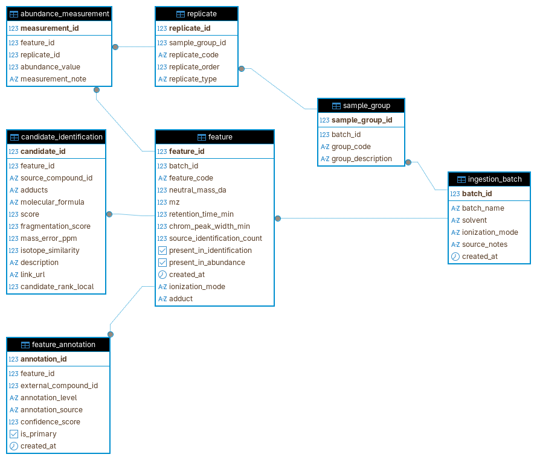
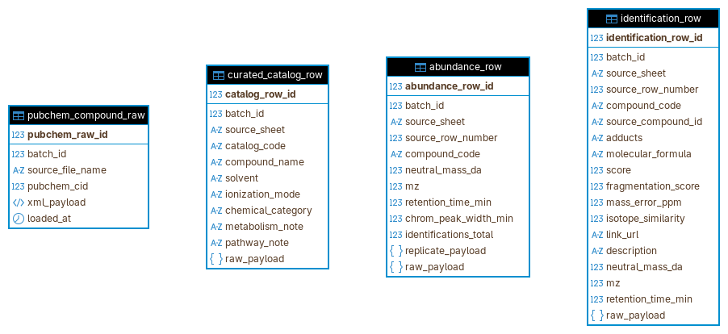
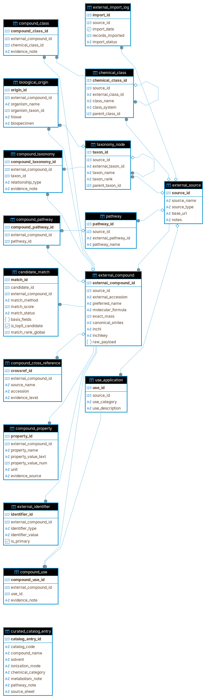
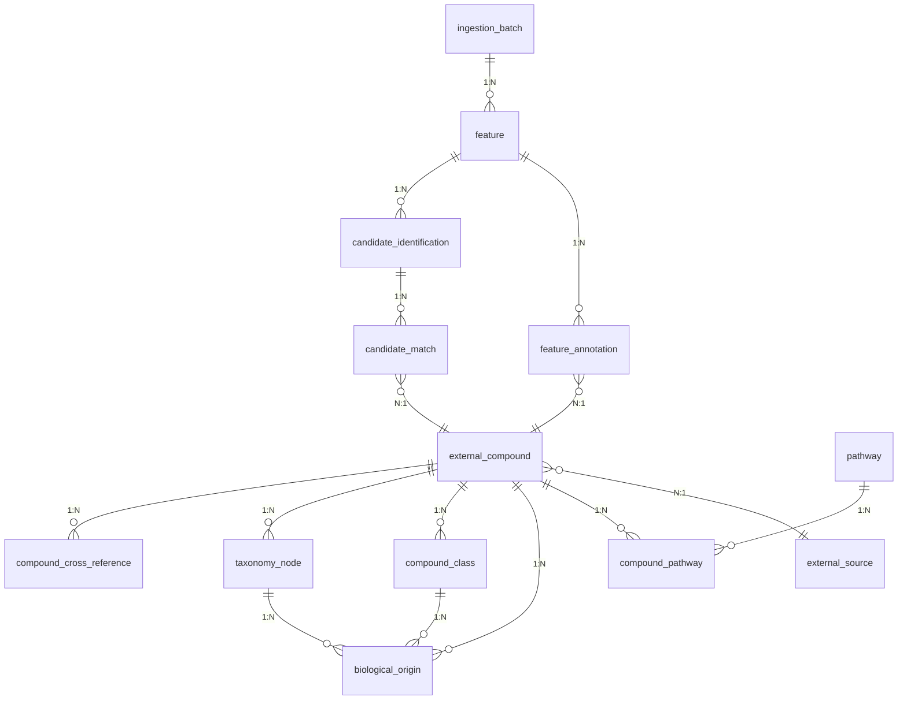
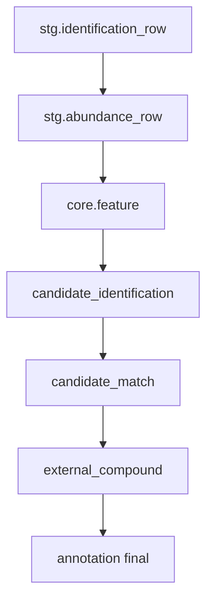

# Schema do Banco de Dados Unificado – IST Ambiental

## Projeto Aplicado II – Integração BD II + Metabolômica

### Objetivo

Este documento descreve o schema lógico do banco de dados unificado desenvolvido para integrar:

- Dados experimentais de telemetria metabolômica (IST Ambiental)
- Dados estruturais químicos externos (PubChem)
- Classificações químicas
- Origem biológica
- Vias metabólicas
- Identificadores cruzados

A modelagem garante integridade referencial completa através de chaves primárias e estrangeiras.

### Arquitetura do Banco

O banco foi organizado em três schemas principais:

- **core** → dados experimentais
- **stg** → dados brutos importados
- **ref** → dados de referência externos

Essa separação permite:

- Rastreabilidade
- Versionamento
- Integração progressiva
- Auditoria científica

### Integração Telemetria IST + PubChem

A integração ocorre através da cadeia:

```
feature → candidate_identification → candidate_match → external_compound
```

Relacionando:

- Telemetria experimental
- Descrições estruturais químicas externas

## Modelos Lógicos

Abaixo estão os diagramas lógicos dos schemas principais:

### Schema Core (Dados Experimentais)


### Schema STG (Dados Brutos Importados)


### Schema REF (Dados de Referência Externos)


## Entidades Principais

### ingestion_batch

Representa um lote experimental metabolômico.

**Campos principais:**
- batch_id (PK)
- batch_name
- solvent
- ionization_mode

**Relacionamentos:**
- 1 batch → N features

### feature

Representa uma feature metabolômica detectada.

**Campos principais:**
- feature_id (PK)
- batch_id (FK)
- feature_code
- mz
- neutral_mass_da
- retention_time_min

**Relacionamentos:**
- feature → candidate_identification
- feature → abundance_measurement
- feature → feature_annotation

### candidate_identification

Representa candidatos químicos associados a uma feature.

**Campos principais:**
- candidate_id (PK)
- feature_id (FK)
- molecular_formula
- score
- fragmentation_score

**Relacionamentos:**
- candidate_identification → candidate_match

### candidate_match

Realiza ligação com compostos externos (ex: PubChem).

**Campos principais:**
- match_id (PK)
- candidate_id (FK)
- external_compound_id (FK)
- match_score
- match_status

Permite:
- Ranking global de candidatos
- Top-5 candidatos
- Seleção final automática

### external_compound

Representa compostos químicos externos integrados.

**Campos principais:**
- external_compound_id (PK)
- source_id (FK)
- external_accession
- preferred_name
- molecular_formula
- canonical_smiles
- inchikey

**Relacionamentos:**
- external_compound → identifiers
- external_compound → taxonomy
- external_compound → pathways
- external_compound → chemical_class
- external_compound → biological_origin

### external_source

Define a origem dos dados externos.

**Exemplos de fontes:**
- PubChem
- HMDB
- ChEBI
- KEGG
- SMPDB
- FooDB
- ChemSpider

**Campos principais:**
- source_id (PK)
- source_name
- base_url

**Relacionamentos:**
- 1 source → N external_compound

### compound_cross_reference

Permite interoperabilidade entre bancos químicos.

**Campos principais:**
- crossref_id (PK)
- external_compound_id (FK)
- source_name
- accession

**Exemplo:**
- PubChem CID
- HMDB ID
- ChEBI ID
- KEGG ID

### taxonomy_node

Define origem biológica hierárquica.

**Campos principais:**
- taxon_id (PK)
- parent_taxon_id (FK)
- taxon_name
- taxon_rank

**Relacionamentos:**
- compound_taxonomy
- biological_origin

### compound_class

Classificação química ontológica.

**Campos principais:**
- chemical_class_id (PK)
- class_name
- parent_class_id (FK)

Permite modelar:
- Superclass
- Class
- Subclass

### biological_origin

Define origem experimental ou natural do composto.

**Campos principais:**
- origin_id (PK)
- external_compound_id (FK)
- organism_name
- tissue
- biospecimen
- pathway

### pathway

Representa vias metabólicas.

**Campos principais:**
- pathway_id (PK)
- external_pathway_id
- pathway_name

**Relacionamentos:**
- compound_pathway

### compound_pathway

Relaciona compostos a vias metabólicas.

**Campos principais:**
- compound_pathway_id (PK)
- external_compound_id (FK)
- pathway_id (FK)

### feature_annotation

Tabela de anotação final selecionada.

**Campos principais:**
- annotation_id (PK)
- feature_id (FK)
- external_compound_id (FK)
- confidence_score
- annotation_level

Representa: identificação final validada

## Modelos Lógicos

### Diagrama ER - Esquema Principal



### Diagrama de Fluxo - Pipeline de Integração



## Integridade Referencial

O banco garante consistência através de:

### Chaves Primárias
- feature_id
- candidate_id
- external_compound_id
- pathway_id

### Chaves Estrangeiras
- feature.batch_id
- candidate_identification.feature_id
- candidate_match.external_compound_id
- compound_pathway.pathway_id
- biological_origin.organism_taxon_id

## Fluxo de Integração de Dados

Pipeline lógico:

```
stg.identification_row
stg.abundance_row
↓
core.feature
↓
candidate_identification
↓
candidate_match
↓
external_compound
↓
annotation final
```